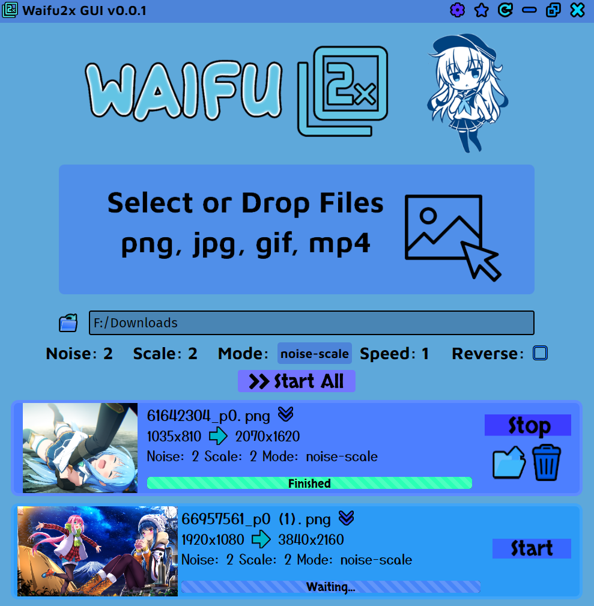

## Waifu2x GUI

This is a GUI app that can upscale anime-styled images, gifs, and videos using waifu2x or Real-ESRGAN Anime. It aims to be simple to use, but
you can access more advanced settings in the top bar.

Note: Upscaling videos and gifs will take a very long time without a high-end graphics card!

### Features:
- Upscale and/or denoise images (png, jpg, webp, etc.)
- Upscale and/or denoise animated images (gif, animated webp)
- Upscale and/or denoise videos (mp4, webm, ogv, etc.)
- Apply effects such as speed or reverse (animated images/videos)
- Customize settings (noise, scale, mode, framerate, etc.)
- Upscale multiple images (or multiple frames of an animated image/video) concurrently
- Change the upscaler (waifu2x or Real-ESRGAN Anime)

Warning: Upscaling too many images in parallel can cause your computer to freeze if it runs out of CPU/memory.

### Real-ESRGAN Anime

The Real-ESRGAN Anime upscaler is much faster and gives better results than waifu2x, so it is recommended to use it instead. The default is waifu2x, as that is the program name obviously. 

Real-ESRGAN only supports scale factors between 2-4, and all other waifu2x options are ignored. By setting the scale factor to 4x, it will use the slower Anime4x model but this gives better results, so it is recommended to upscale images at 4x when using Real-ESRGAN.

### Installation

To install, download the latest installer from the [releases](https://github.com/Tenpi/Waifu2x-GUI/releases) tab. Updates can be installed automatically.

Note: If you install it under `C:/Program Files` you might need to run it as administrator.

### MacOS
To use waifu2x, you need to compile waifu2x-converter-cpp from source. See [here](https://github.com/DeadSix27/waifu2x-converter-cpp/blob/master/BUILDING.md#macos--osx), you may need to edit the clang and llvm paths in CMakeLists.txt (for me it was in `/opt/homebrew/Cellar` instead of `/usr/local`).

Replace the `waifu2x-converter-cpp.app` in `/Applications/Waifu2x GUI.app/Contents/Resources/app.asar.unpacked/node_modules/waifu2x/waifu2x` with your compiled version. 

### Bugs and Requests

Open an issue on my GitHub repository. I appreciate any requests, but I can't guarantee that I will fulfill all of them.

### Related/Credits

- [my waifu2x npm module](https://github.com/Tenpi/waifu2x)
- [waifu2x-converter-cpp](https://github.com/DeadSix27/waifu2x-converter-cpp)
- [waifu2x](https://github.com/nagadomi/waifu2x)
